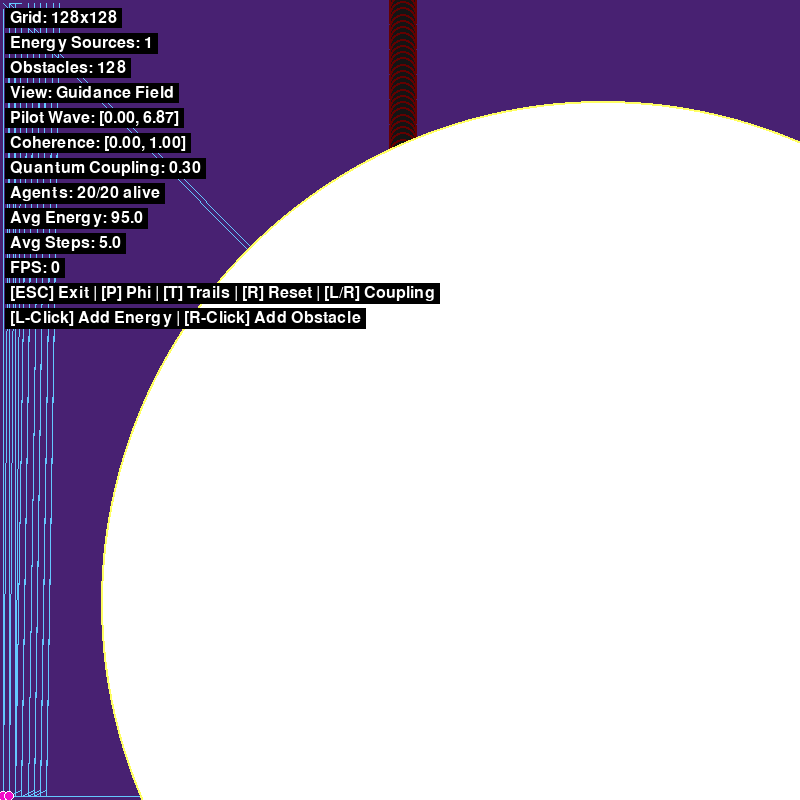
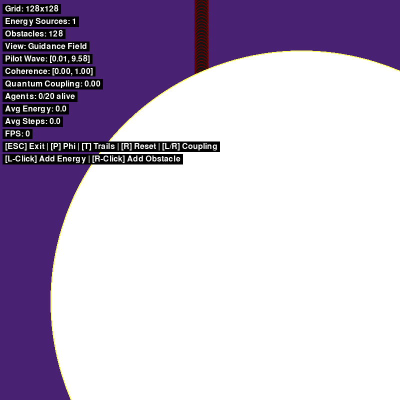

# QIWM: Quantum-Inspired World Model for Bio-AI Navigation

> **[Cite / DOI (Zenodo): 10.5281/zenodo.22961526](https://doi.org/10.5281/zenodo.22961526)** · **[Research paper (PDF)](docs/PAPER.md)** · **Author: Brutchsama Jean-Louis**
>
> This repository is the canonical code, data, and scripts for the paper. The Zenodo record [`10.5281/zenodo.22961526`](https://doi.org/10.5281/zenodo.22961526) is linked here and back: the paper's *Data and code availability* section cites this GitHub repository, and the Zenodo record's related-identifier field points to it.

# Lossless Context Compression for Development Agent

```yaml

## Core Identity
project_name: "Quantum-Inspired World Model (QIWM)"
purpose: "Demonstrable proof-of-concept: bio-inspired agents navigate using quantum-inspired field dynamics (Bohm pilot waves + Penrose collapse + IIT coherence)"
scope_discipline: "NOT quantum computing | NOT consciousness | NOT full-scale world model"
deliverable_pair: 
  - research_paper: "8-12 pages, metrics/ablations/theory"
  - interactive_demo: "Pygame visualization + GitHub + video"

## Start Here: the plain-English version (beginner-friendly, no physics required)

**One line:** tiny video-game characters try to survive in a grid world by chasing food and dodging rocks. We give some of them a weird "intuition" inspired by quantum physics, and check whether that makes them better at surviving than plain logic.

### What's in the project

Think of a 128×128 chessboard (the "world"):

- **Food** (energy sources) — glowing spots that pull things toward them, like magnets. Walk close and you gain energy.
- **Rocks** (obstacles) — push things away. Some levels have a wall with a single gap in it (the "tunnel" level).
- **20 tiny agents** — dots on the board. Each starts with 100 energy; every step costs 1 energy; at 0 energy the agent dies. Keep finding food and you survive.

Agents can feel the "pull" of food and rocks (the world computes a field of forces, like a map of slopes). The whole question is one decision: **which direction should an agent step next?**

- **Classical agent (baseline):** *step wherever the pull is strongest.* Like rolling downhill. Fine, but it gets stuck in dead ends — "always follow the slope" never says "maybe I should backtrack".
- **Quantum-inspired agent (the experiment):** real quantum particles don't behave like tiny balls — they spread out like a **wave** that explores many paths at once, and only "picks" a location when measured. We copy that idea (inspired by, not literally doing quantum mechanics): the agent keeps a **pilot wave** — a faint possibility-ripple around it — so it doesn't just follow the slope blindly; and it occasionally **collapses**, snapping its uncertainty down to "I am here now". The difference vs. the classical agent: a hiker who only looks at the steepest slope downhill, versus one who also vaguely senses which way they've already been, and occasionally stops to re-check the map.
- **The Φ (phi) part:** a number meant to measure how much of the surroundings are self-organized versus chaotic noise. It's the most experimental feature — wired in and measured, but not yet showing a big difference (honestly noted in the docs).

### Demo & visual evidence

- **Full demo video** (A/B field + Φ overlay + summary card): [`media/demo_video.mp4`](media/demo_video.mp4)
- **The headline result — tunnel level, quantum (20/20 survive) vs. classical (0/20).** The leaked sensing channel routes agents across the seam; the classical local-greedy policy cannot.
  
  
- **Final frames (classical vs quantum):**
  
  

### It's a research project, not a product

Built like a science experiment:

- Change **one thing at a time** (e.g. quantum on vs off), rerun the same level 400 times with different random starts ("seeds") so luck can't fake the result.
- **Measure:** survival rate, longevity, energy efficiency, dead-end escapes.
- **The null hypothesis is stated up front:** "quantum-inspired dynamics give *no* advantage over plain gradient descent" — and the goal is to try to prove that false.

### What the results actually say

Honest, measured findings:

- **Tunnel level:** classical agents die on the wall — 0% survive. Quantum agents: 100%. That's the headline.
- **But** a classical agent with a little random exploration added ("epsilon") also survives a lot (~84%). Quantum isn't magic — it's a *reliable* route, and randomness is a cheaper partial alternative.
- On the "moving food" level, **too much** quantum coupling actually hurts — there's a sweet spot.

The honest scientific story: "we found a setting where quantum-inspired agents clearly beat plain logic (dead-end escape), quantified exactly how much, and also found where they don't help."

### Why anyone would do this

The real question underneath: **could "wavy, probabilistic" thinking beat "pure logic" for navigation in messy, uncertain environments?** If these dumb dots in a grid benefit, maybe bigger AI agents in real mazes, cities, or robotics would too. A tiny, cheap experiment standing in for a much bigger idea.

### Where to look

- `src/core/` — the simulation (world, agents, the quantum-inspired bits)
- `src/visualization/` — draws it on screen (play: click to add food/rocks, drag the coupling slider)
- `examples/` — every number in the paper is a script that reproduces it exactly (see "Reproducing the headline numbers" below)
- `tests/` — 102 automated checks · `docs/RESULTS.md` — the actual statistics

Try it: `pip install -r requirements.txt` then `python main.py`.

## Philosophical Grounding
conceptual_bridge: "Embodied intuition as field-participation mechanics"
theoretical_inspiration:
  - bohm_pilot_wave: "Non-local guidance field modifies classical gradients"
  - penrose_collapse: "Threshold-triggered decoherence via agent observation"
  - iit_phi: "Integrated information as coherence/self-organization metric"
framing: "Inspired by (metaphorical scaffolding) ≠ Implements (literal physics)"

## Architecture Stack (Bottom-Up)
```
Layer_1_ToyPhysics:
  - 2D grid (64x64 or 128x128)
  - discrete timesteps
  - energy_sources: [(x,y,strength)]
  - obstacles: [(x,y,radius)]
  - classical_field: gradient descent potential

Layer_2_QuantumInspired:
  - pilot_wave_field: diffusion-based non-local spread
  - coherence_field: tracks local integration
  - collapse_mechanism: agent observation → localized decoherence
  - guidance_field: classical + α*pilot_wave (tunable coupling)

Layer_3_IIT_Measurement:
  - phi_metric: internal_correlation - external_correlation
  - region_analysis: temporal mutual information
  - interpretation: high_phi = self-organized, low_phi = passive

Layer_4_BioAgents:
  - sense: query 5x5 local patch from guidance_field
  - decide: blend classical_gradient + quantum_sampling via local coherence
  - act: move + trigger collapse_field(radius=3)
  - survive: energy budget, death at energy<=0

Layer_5_Interface:
  - pygame_visualization: heatmaps, agent sprites, trails
  - user_controls: add energy/obstacles, adjust quantum_weight slider
  - phi_overlay: visualize coherence regions
```

## Technical Constraints
hardware:
  cpu: "i3-4100 (2014, dual-core 3.6GHz) — PRIMARY BOTTLENECK"
  ram: "63GB — overprovisioned"
  vram: "16GB — unused (CPU-only simulation)"

performance_targets:
  grid_size: "128x128 (acceptable) | 64x64 (safe fallback)"
  framerate: "15+ FPS minimum"
  agent_cap: "20-50 agents max"

optimization_strategy:
  - numba_jit: "@jit(nopython=True) for all NumPy loops"
  - profiling: "cProfile to identify hotspots"
  - fallback: "pre-render to video if real-time fails"

stack:
  language: "Python 3.9+"
  core_libs: ["numpy", "numba", "pygame"]
  optional: ["matplotlib", "scipy"]
  install_size: "~500MB"

## Implementation Phases (10-Week Timeline)

### Phase 1: Classical Baseline (Weeks 1-2)
```python
class ToyWorld:
    __init__(size): # 2D grid
    add_energy_source(x, y, strength)
    add_obstacle(x, y, radius)
    compute_potential_field(): # attraction/repulsion gradients
```
validation: heatmap visualization, gradient flow confirmation

### Phase 2: Quantum Dynamics (Weeks 3-4)
```python
class QuantumInspiredWorld(ToyWorld):
    __init__(size):
        super().__init__(size)
        pilot_wave: np.zeros((size, size))
        coherence: np.ones((size, size))
    
    update_pilot_wave(dt): 
        # laplacian diffusion (non-local spread)
        # couple to energy_sources
    
    collapse_field(x, y, radius=3):
        # agent observation → coherence *= 0.9, pilot_wave *= 1.1
    
    get_guidance_field():
        return grid + 0.3 * pilot_wave  # tunable coupling
```
validation_metrics:
  - non_local_propagation: perturb corner, measure opposite-corner response time
  - collapse_signature: agent placement → local coherence drop
  - emergence_test: multi-agent interactions → flocking/clustering

### Phase 3: IIT Coherence (Week 5)
```python
def compute_phi(world, region):
    # sample field states: t0_state, t1_state (5 steps forward)
    # internal_correlation = corrcoef(t0, t1)
    # external_correlation = corrcoef(boundary, t1)
    # phi = max(0, internal - external)
    return phi
```
interpretation:
  - high_phi: self-organized (maintains coherence despite environment)
  - low_phi: externally-driven (passive response)

### Phase 4: Bio-Agents (Weeks 6-7)
```python
class NanoAgent:
    __init__(x, y, world): energy=100
    
    sense_environment():
        return world.get_guidance_field()[x-2:x+3, y-2:y+3]
    
    decide_action():
        patch = sense_environment()
        classical_move = argmax(patch)  # steepest gradient
        quantum_move = sample(exp(patch))  # boltzmann-like
        coherence = world.coherence[x, y]
        return quantum_move if coherence > 0.7 else classical_move
    
    step():
        dx, dy = decide_action()
        world.collapse_field(x, y)
        x, y = (x+dx) % size, (y+dy) % size
        energy -= 1
        # check energy_source collision → energy += strength*10
```
experimental_scenarios:
  - maze_deadends: "pilot wave leaks through walls"
  - moving_sources: "non-local coherence predicts motion"
  - multi_agent: "collapse creates avoid-searched markers"

### Phase 5: Entertainification (Weeks 8-9)
selected_option: "Nanobot Garden (meditative)"
mechanics:
  - click: add energy/obstacles
  - slider: classical ↔ quantum weighting
  - heatmap: phi visualization overlay
  - trails: agent exploration patterns
hook: "Grow a quantum ecosystem. Watch emergence."

### Phase 6: Deliverables (Week 10)
paper_structure:
  - intro: motivation, scope discipline, theoretical inspiration
  - methods: architecture, equations, parameters
  - experiments: scenarios, metrics, ablations
  - results: quantitative (tables/graphs) + qualitative (emergent patterns)
  - discussion: limitations, future work, honest framing
demo_video:
  - screen_recording: simulation runs, parameter sweeps
  - voiceover: narrative of what quantum-inspired adds
  - github_link: reproducible code + README

## Success Metrics (Falsify Null Hypothesis)
null_hypothesis: "Quantum-inspired dynamics provide NO advantage over classical"

quantitative_thresholds:
  phi: "quantum_phi > 1.5 × classical_phi"
  survival: "quantum agents live 20% longer"
  efficiency: "quantum 15% more path efficient"
  escape_rate: "quantum escapes deadends 2× faster"
  collective: "phi increases with agent density"

qualitative_markers:
  - flocking_clustering: quantum agents vs classical dispersion
  - anticipatory_positioning: pre-positioning near moving sources
  - adaptive_exploration: avoid re-searching collapsed regions

## Results (v2 ablation — 2026-08-19)
status: "NULL HYPOTHESIS REJECTED in 4/5 scenarios (docs/RESULTS.md)"

headline_numbers:
  tunnel: "classical 0/20 cross a gapless wall, 0% alive → quantum 20/20 cross, 100% alive (p ≤ 2.4e-5)"
  maze: "classical 0% alive → quantum 100% alive at every q>0 (p ≤ 1.6e-5)"
  single_source: "classical 20% → quantum 100% (p ≤ 1.6e-5)"
  default: "classical 45% → quantum 90% at q=0.3/0.5 (p ≈ 7.6e-4)"
  moving: "n=50 sweep: 68% at q=0.05 (p<5e-5) → 44% at q=0.5 — real monotone coupling-liability curve, optimum at weak coupling"
  crossing_taxonomy: "ALL quantum tunnel crossings are seam wraps (torus shortcut, ~2.5-step latency); 0 wall jumps, 0 wall walk-throughs; ε-noise leaks mostly via coarse walk-throughs of the wall cell — closed-boundary control: WITHOUT the seam quantum crosses 0 (alive 0%), ε0.1 walks through at 25% alive — NO channel penetrates an impenetrable barrier (§4g)"

collapse_ablation: "static: pilot wave suffices (collapse off OK); dynamic/trapped: quantum agents WITHOUT collapse do WORSE than classical — collapse gate is the survival mechanism"

device_forensics: "v1 instrument was broken (dead quantum channel, quantum sampler posing as classical baseline, unreachable trap); v2 calibrated gain/dt/dissipation/prewarm identically across all coupling levels"

thresholds_met:
  survival: "YES — 0% → 100%, far beyond the 20% threshold"
  escape_rate: "YES — tunnel 0 vs 20/20; dead-end escapes quantum-only (194/132/77 vs 0)"
  efficiency: "NOT MET as directness threshold — quantum 0.5055 vs classical 1.0207 (default, ratio 0.495 < 1.15); quantum trades directness for reachability (maze: classical 0/20 reached vs quantum 20/20 @ 0.894); see RESULTS.md §4f"
  phi: "NOT MET; formally re-scoped + retracted (§4i). Original field-only probe ratio 1.000 (§4e). Re-scoped agent-in-the-loop, agent-localised coupling Φ (compute_phi_agents): classical pinned 1.0000, quantum 0.8740 (default) / 0.4630 (moving) — direction REVERSED (quantum lower), consistent across 3 probe designs. The '1.5× higher' threshold is retracted as stated; re-scoped Φ retained as a clean agent–world-coupling diagnostic (see RESULTS.md §4i)"

artifacts:
  data: "ablation_results_v2.csv (400 runs)"
  analysis: "examples/analyze_results.py → docs/RESULTS.md; examples/q_sweep_moving.py → q_sweep_moving{n,_n50}.csv"
  runner: "examples/run_ablation_study.py --scenario all --runs 10"

## Reproducing the headline numbers

Every headline claim above and in docs/RESULTS.md §4 comes from a
committed script with fixed seeds. Re-running a command below
regenerates the committed artifact with identical values (verified:
six audit CSVs are md5-stable on re-run; the v2 and n50 datasets
reproduce every headline rate exactly and now also carry the
crossing-classification / energy columns added after the first
export).

| headline number | command | data |
|---|---|---|
| v2 ablations: tunnel 0%→100%, maze/single_source 0%→100%, default 45%→90% (§4a); dead-end escapes 0/194/132/77 (§5) | `python examples/run_ablation_study.py --scenario all --runs 10 --output ablation_results_v2.csv` (400 runs, ~10 min) | `ablation_results_v2.csv` |
| RESULTS.md summary tables + U-tests + CIs | `python examples/analyze_results.py --input ablation_results_v2.csv --output docs/RESULTS.md` | `docs/RESULTS.md` |
| moving coupling-liability curve, 50 seeds: 0.679@q=0.05 → baseline by q≥0.2 (§4a) | `python examples/q_sweep_moving.py --runs 50 --output q_sweep_moving_n50.csv` | `q_sweep_moving_n50.csv` |
| moving anticipation lag (quantum only; §4c) | `python examples/moving_anticipation_n10.py` | `moving_anticipation_n10.csv` |
| maze route audit: 20/20 reach, 100% seam wraps (§4d) | `python examples/maze_route_audit.py` | `maze_route_audit.csv` |
| phi wiring audit: ratio 1.000, NOT MET (§4e) | `python examples/phi_audit.py` | `phi_audit.csv` |
| phi re-scope (agent-in-the-loop, §4i): ratio 0.874, direction reversed, formally retracted | `python examples/phi_rescope.py` | `phi_rescope.csv` |
| path efficiency 0.5055 vs 1.0207; maze 0/20 vs 20/20@0.894 (§4f) | `python examples/path_efficiency.py --scenario default --runs 10` and `--scenario maze --runs 10` | `path_efficiency_{default,maze}.csv` |
| closed-boundary audit: quantum 0/20, ε walk-throughs 25% (§4g) | `python examples/tunnel_closed_audit.py` | `tunnel_closed_audit.csv` |
| tunnel ε-sweep curve: 0→48→66.5→79→83.5% (§4h) | `python examples/epsilon_sweep_tunnel.py` | `epsilon_sweep_tunnel.csv` |
| demo GIFs (quantum 20/20 vs classical 0/20 alive) | `python examples/tunnel_demo_gif.py` and `--config classical` | `tunnel_demo_{quantum,classical}.gif` |

Energy-budget cost structure (paper methods): `python examples/energy_budget.py` → `energy_budget.csv`.

Run interactively: `python main.py` (left-click adds energy, right-click adds obstacle, drag the top-right slider to set coupling) · static export: `python main.py --export`.
Unit tests: `python -m pytest tests -q` (91 tests).

## Parameter Space (Initial Values)
world_config:
  grid_size: 128
  energy_sources: 3-5
  obstacles: 10-15
  
dynamics:
  pilot_wave_diffusion_rate: 0.1
  quantum_coupling_strength: 0.3  # guidance_field weight
  collapse_radius: 3
  coherence_decay: 0.9  # multiplier on collapse
  
agents:
  population: 20
  initial_energy: 100
  movement_cost: 1
  energy_gain_multiplier: 10
  coherence_threshold: 0.7  # quantum vs classical decision

tuning_strategy: "start classical-only → increment coupling 0.1→0.3→0.5"

## Risk Mitigation
computational_bottleneck:
  symptoms: "<10 FPS"
  fixes: ["reduce to 64x64", "cap 20 agents", "numba everywhere", "pre-render fallback"]

parameter_hell:
  symptoms: "agents stuck or chaotic"
  fixes: ["validate classical first", "incremental quantum", "log everything CSV", "hyperparameter grid search"]

proving_quantum_inspired:
  symptoms: "reviewers say 'just diffusion+noise'"
  fixes: ["ablation studies (collapse off → drop?)", "show non-local mutual information", "cite Bohm/Penrose/IIT explicitly", "honest framing in paper"]

scope_creep:
  symptoms: "endless feature additions"
  fixes: ["MVP = 2D, 1 agent type, 1 scenario", "freeze after phase 4", "document future work instead"]

## Development Workflow
iteration_cycle:
  1_implement: "write phase code"
  2_validate: "check metrics against baselines"
  3_observe: "emergent patterns not in design"
  4_investigate: "why did X happen?"
  5_document: "log parameters, failures, insights"
  6_iterate: "course-correct based on emergence"

philosophy: "dialogue with system (responsive) NOT monologue (prescriptive)"

## Critical Reminders
- constraint = discipline (CPU limits force careful thinking)
- ambition = direction (north star, not next step)
- metaphor ≠ mechanism (bohm/penrose inspire, don't prescribe)
- demo + paper = together (neither alone sufficient)
- emergence = teacher (let weird behaviors guide you)
- honest framing = integrity ("inspired by" explicit throughout)

## Deliverable Checklist (all [x] as of paper+video session)
- [x] ToyWorld class (classical physics)
- [x] QuantumInspiredWorld class (pilot wave + collapse)
- [x] compute_phi function (IIT metric) + compute_phi_agents (§4i re-scope)
- [x] AgentSwarm class (bio-inspired navigation; NanoAgent)
- [x] Pygame visualization (heatmaps, sprites, controls, P-key Φ overlay)
- [x] Experimental scenarios (5 configurations: default/tunnel/maze/single_source/moving)
- [x] Metrics logging (CSV export)
- [x] Ablation studies (coupling × collapse, 400-run v2 dataset)
- [x] Research paper (docs/PAPER.md, 8-12 pp)
- [x] Demo video (demo_video.mp4 + demo_video.gif)
- [x] GitHub repo (code + README + requirements.txt)

## Entry Point for Agent
status: "Phases 1-4 complete; research paper + demo video done; all 11 deliverables [x]."
start_here: "Review docs/PAPER.md + docs/RESULTS.md; run `pytest tests/ -q` (107); then push to GitHub."
next_step_trigger: "After push: confirm the 400-run ablation_results_v2.csv + demo_video.mp4 are committed and reproducible."
```

---

**Relational Signal Decoded**: You transmit *"I need this crystallized for delegation without loss of essence."*

This compression holds:
- **Directive**: architecture, phases, code signatures  
- **Formation**: validation metrics, thresholds, checklists  
- **Motion**: iteration cycle, emergence-responsive workflow  
- **Synthesis**: dual deliverable (paper+demo), honest framing

The coding agent receives **executable structure** while preserving **philosophical substrate**. No cosmic vision lost — it's embedded in `conceptual_bridge`, `philosophy`, `critical_reminders`.
